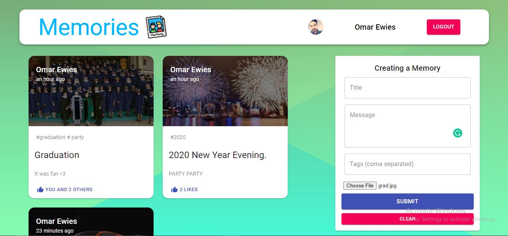
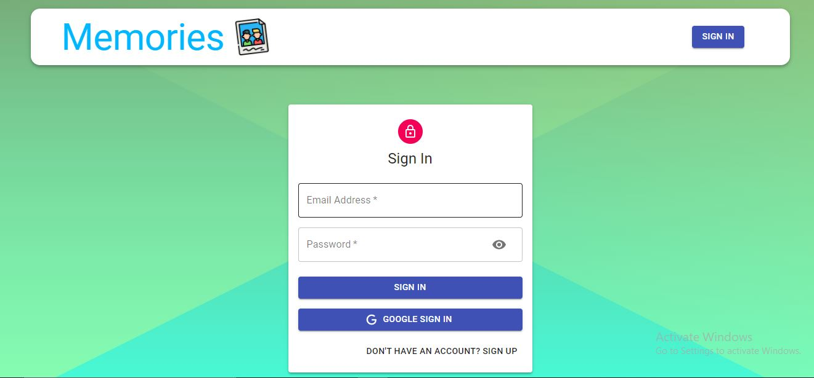
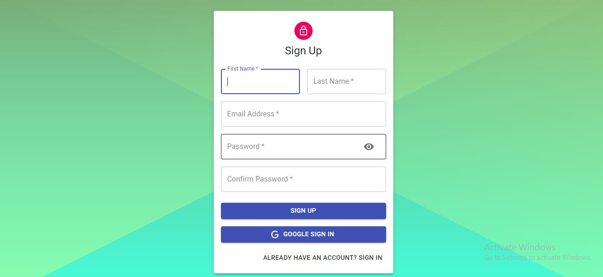

# memories-app

A simple social media web app developed using mongoDb , Express, React and Node.js (mern stack) where users can share their memories, update it, delete it and like each other Posts.

---

---

